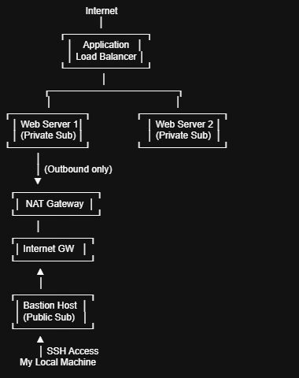

🚀 Deploying a Secure Web Application on AWS Using Bastion, Ansible & Load Balancer

As part of my journey into Cloud Architecture and DevOps, I designed and deployed a secure, production-style web application architecture on AWS, and this article walks through the architecture, settings, and challenges encountered.

🏗 Architecture Overview

The infrastructure was deployed in a custom VPC with the following components:
- 1 Bastion Host (Public Subnet)
- 2 Web Servers (Private Subnet)
- 1 Application Load Balancer (Public Subnets)
- NAT Gateway (for outbound internet from private subnet)
- Ansible for automated configuration

🖼 Architecture Diagram

                     Internet
                         │
                 ┌───────────────┐
                 │ Application   │
                 │ Load Balancer │
                 └───────┬───────┘
                         │
        ┌────────────────┴────────────────┐
  
        │                                 │
 ┌───────────────┐                 ┌───────────────┐

 │ Web Server 1  │                 │ Web Server 2  │
 
 │ (Private Sub) │                 │ (Private Sub) │
 
 └───────────────┘                 └───────────────┘
        │
        
        │ (Outbound only)
        ▼
   ┌───────────────┐
   
   │  NAT Gateway  │
   
   └───────────────┘
        
        │
        
   ┌───────────────┐
 
   │ Internet GW   │
   
   └───────────────┘
   
        ▲
        │
  
   ┌───────────────┐
   
   │ Bastion Host  │
   
   │ (Public Sub)  │
   
   └───────────────┘
   
        ▲
        │ SSH Access
     My Local Machine

🔐 Why I Used a Bastion Host

A Bastion Host (Jump Server) is a security best practice, and it helps limit direct internet exposure of application servers. Instead of giving public access to every server:
- Only the Bastion has a public IP
- Web servers have no public IP
- SSH access to web servers is allowed only from the Bastion Security Group

⚙ How Ansible Simplified Deployment

Rather than manually installing NGINX on each server, I used Ansible automation with the command below;

ansible-playbook -i inventory.ini deploy-nginx.yml

So instead of logging into 2 servers and configuring manually, the playbook performed these automatically to both servers:

- NGINX installation
- Service startup and enablement
- Deployment of a dynamic HTML page
- Hostname-based instance identification

This helps ensure consistency across environments, and repeatable deployments.

🌍 Direct EC2 Access vs Load Balancer Access

With direct EC2 access, the server’s public IP is exposed to the internet, making it directly reachable and more vulnerable to attacks. Users connect to a specific instance, which limits scalability and creates a single point of failure. If that server goes down, the application becomes unavailable. There is also no built-in traffic distribution, so performance can degrade under heavy load.

In contrast, using an Application Load Balancer (ALB) hides the backend servers inside a private subnet. The ALB acts as a protective layer, exposing only a single public DNS endpoint while routing traffic to multiple private EC2 instances. It distributes requests evenly, performs health checks, and automatically reroutes traffic away from unhealthy servers. This improves security, scalability, availability, and overall user experience.

❌ Direct EC2 Access - If the web servers had public IPs, this means that anyone can access them directly

User Browser
    
    ↓
    
    [Internet]
    
    ↓

EC2 Instance (Public IP)

    ↓

NGINX on Port 80

    ↓

 Web Application

✅ Load Balancer Access

With an Application Load Balancer: Only ALB is internet-facing, and the web servers remain private.
Also, traffic is distributed evenly, and refreshing the ALB DNS showed alternating instance hostnames — confirming load balancing worked.

In this project, the ALB approach ensured a more secure, resilient, and production-ready architecture.

⚠ Challenges

I encountered some challenges during the task as seen below;

- Challenge 1: SSH From Bastion to Private Web Servers Failed

While I could SSH into the Bastion, I could not "jump" to the private web servers. Even when using the -A (Agent Forwarding) flag, I received a Permission denied (publickey) error. 

During troubleshooting, I noticed it failed because the local SSH agent was not running on my local Vagrant VM. Also, no private key was loaded into the authentication agent. 
Hence, Bastion could not access my key, which was why authentication to private servers failed.

✅ Solution - 

I ran the following 3 commands on my Vagrant VM to manually initialize the SSH environment to ensure the keys were "live" in memory:

1️⃣ - eval "$(ssh-agent -s)"

This started the SSH authentication agent, set the required environment variables, and enabled the shell to communicate with the agent

2️⃣ - ssh-add ~/key_pairs.pem

This added my private key to the agent, and made it available for authentication and forwarding

3️⃣ - ssh-add -l

This listed the loaded keys and confirms successful configuration. 
These steps allowed the Bastion to "borrow" my local key to authenticate with the private servers without storing the actual .pem file on the Bastion itself.

After reconnecting with my Bastion public IP -
ssh -A -i ~/key_pairs.pem ubuntu@108.131.138.159

I successfully accessed both private web servers!

- Challenge 2: Ansible Playbook Failed (No Internet in Private Subnet)

After establishing SSH connectivity, the Ansible playbook failed during the Nginx installation. The private web servers could not reach the Ubuntu repositories to download packages. 

I noticed this was because they were in a private subnet, and they had no route to the internet.

✅ Solution: Configure NAT Gateway

I implemented a NAT Gateway to provide secure outbound-only internet access:

- Allocated an Elastic IP and created a NAT Gateway within the Public Subnet.
- Updated the Private Route Table to direct all 0.0.0.0/0 traffic to the NAT Gateway.
This enabled the servers to "reach out" for updates and Nginx installation while still preventing the "public" from reaching in.

The Ansible playbook ran successfully as seen below - 

ansible-playbook -i inventory.ini deploy-nginx.yml

PLAY [Configure Web Servers] *******************************************************************************************

TASK [Gathering Facts] *************************************************************************************************
ok: [webserver2]
ok: [webserver1]

TASK [Show target host] ************************************************************************************************
ok: [webserver1] => {
    "msg": "Deploying to webserver1"
}
ok: [webserver2] => {
    "msg": "Deploying to webserver2"
}

TASK [Install NGINX] ***************************************************************************************************
changed: [webserver1]
changed: [webserver2]

TASK [Ensure NGINX is running] *****************************************************************************************
ok: [webserver2]
ok: [webserver1]

TASK [Deploy HTML page] ************************************************************************************************
changed: [webserver1]
changed: [webserver2]

PLAY RECAP *************************************************************************************************************
webserver1                 : ok=5    changed=2    unreachable=0    failed=0    skipped=0    rescued=0    ignored=0
webserver2                 : ok=5    changed=2    unreachable=0    failed=0    skipped=0    rescued=0    ignored=0

